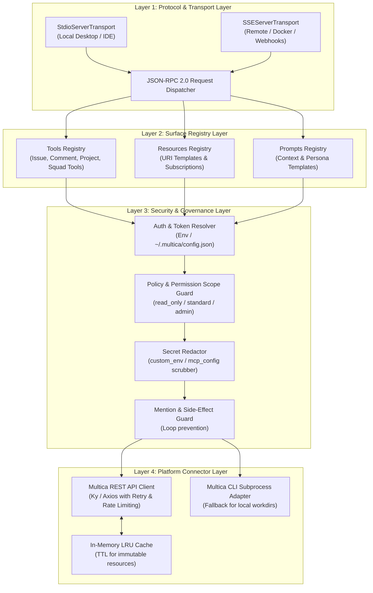
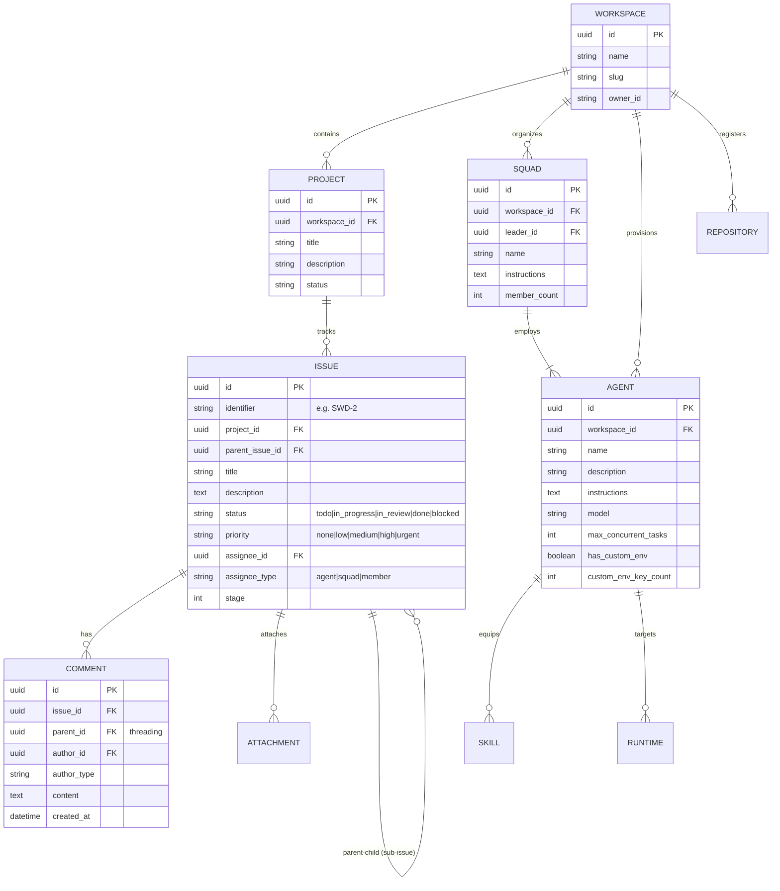
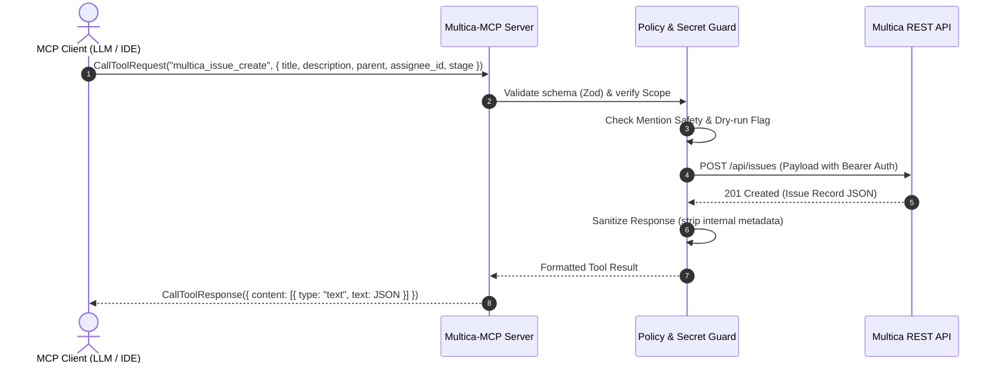
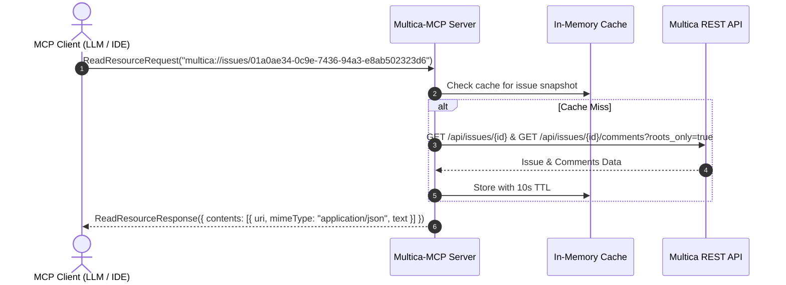

# Multica-MCP System Architecture & Design Specification

- **Project**: Multica-MCP
- **Author**: Lead System Architect
- **Date**: 2026-09-17
- **Version**: 1.0.0
- **Status**: Ready for Implementation

---

## 1. Executive Summary & Objectives

**Multica-MCP** is the official Model Context Protocol (MCP) server bridge for the Multica platform. It exposes Multica's core entities (Workspaces, Projects, Issues, Comments, Attachments, Agents, Squads, and Repositories) as standardized MCP **Resources**, **Tools**, and **Prompts**.

By integrating Multica-MCP, AI clients (e.g., Claude Desktop, Cursor, Goose, Zed, or external agent runtimes) can participate in Multica software engineering workflows as first-class collaborators.

```mermaid
flowchart LR
    subgraph Clients["MCP Clients & IDEs"]
        CD["Claude Desktop"]
        CR["Cursor / Zed"]
        EA["External AI Agents"]
    end

    subgraph MulticaMCP["Multica-MCP Server"]
        GW["MCP Protocol Gateway\n(stdio / SSE Transport)"]
        SRV["MCP Surface\n(Tools, Resources, Prompts)"]
        SEC["Security & Policy Gate\n(Scope & Redaction)"]
        ADPT["Multica Platform Client / Adapter"]
    end

    subgraph Platform["Multica Core Backend"]
        API["Multica REST API"]
        WS["Workspace & Project DB"]
        DMN["Local Multica Daemon / CLI"]
    end

    Clients <-->|JSON-RPC 2.0 (stdio/SSE)| GW
    GW <--> SRV
    SRV <--> SEC
    SEC <--> ADPT
    ADPT <-->|HTTPS REST / Auth Bearer| API
    ADPT <-->|IPC / Subprocess| DMN
    API <--> WS
```

---

## 2. Component & Layered Architecture

Multica-MCP is structured into four distinct layers:



---

## 3. Data Model & Entity Relations (ERD)

The domain entities mapped by Multica-MCP reflect the core Multica platform schema:



---

## 4. Sequence Workflows

### 4.1. Tool Execution: Creating a Sub-Issue & Assigning Squad



### 4.2. Resource Read: Hydrating Issue and Comment Thread



---

## 5. MCP Surface Catalog Specification

### 5.1. Standard MCP Tools

| Tool Name | Scope | Description |
|---|---|---|
| `multica_issue_get` | `read_only` | Retrieve full issue details by ID or identifier. |
| `multica_issue_list` | `read_only` | List issues in a project/workspace with filtering by status, priority, and assignee. |
| `multica_issue_create` | `standard` | Create a new issue or sub-issue (with parent ID and stage). |
| `multica_issue_update` | `standard` | Update issue fields (title, description, status, priority, assignee). |
| `multica_issue_status` | `standard` | Transition issue status (`todo`, `in_progress`, `in_review`, `done`, `blocked`). |
| `multica_issue_comment_list`| `read_only` | List issue comment threads with bounded summary or thread tail options. |
| `multica_issue_comment_add` | `standard` | Add a comment or reply to a thread (with mention safety checks). |
| `multica_project_list` | `read_only` | List projects in workspace with status and resource counts. |
| `multica_agent_list` | `read_only` | List agents with roles, model configurations, and skills. |
| `multica_agent_get` | `read_only` | Inspect agent specifications (secrets always redacted). |
| `multica_squad_list` | `read_only` | List squads, team rosters, and instructions. |
| `multica_squad_get` | `read_only` | Retrieve specific squad details and leader routing rules. |
| `multica_repo_list` | `read_only` | List registered git repositories for the workspace. |

### 5.2. Standard MCP Resource URIs

- `multica://workspaces/current` — Active workspace metadata.
- `multica://projects/{projectId}` — Project overview and resources.
- `multica://issues/{issueId}` — Issue snapshot with parent/child tree.
- `multica://issues/{issueId}/threads/{threadId}` — Bounded comment thread transcript.
- `multica://agents/{agentId}` — Agent instructions and capability contract.
- `multica://squads/{squadId}` — Squad routing rules and member directory.

### 5.3. Standard MCP Prompts

- `multica_issue_triage`: Prompt template for triaging incoming bug reports or feature requests and suggesting squad assignments.
- `multica_architecture_review`: Prompt template for conducting Docs-as-Code architectural analysis and drafting ADRs.
- `multica_squad_dispatch`: Prompt template for breaking epics into staged sub-tasks for Backend, Frontend, DevOps, and QA.

---

## 6. Implementation Roadmap & Task Breakdown

### Phase 1: Core Foundation & SDK Adapter (Backend Engineer)
- [ ] Task 1.1: Project initialization (`package.json`, TypeScript, `tsup`, ESLint, Prettier).
- [ ] Task 1.2: Implement Multica API HTTP Client (`src/client/api-client.ts`) with Token Auth & Error Envelope handling.
- [ ] Task 1.3: Implement Configuration & Token Resolver (`src/config/index.ts`) supporting ENV and `~/.multica/config.json`.
- [ ] Task 1.4: Implement Secret Redaction & Policy Guard (`src/security/redactor.ts`, `src/security/guard.ts`).

### Phase 2: MCP Surface Implementation (Backend Engineer)
- [ ] Task 2.1: Implement Issue & Comment Tools (`src/tools/issues.ts`, `src/tools/comments.ts`).
- [ ] Task 2.2: Implement Project, Agent & Squad Tools (`src/tools/projects.ts`, `src/tools/agents.ts`, `src/tools/squads.ts`).
- [ ] Task 2.3: Implement Resource Providers (`src/resources/index.ts`).
- [ ] Task 2.4: Implement Standard Prompts (`src/prompts/index.ts`).

### Phase 3: Transports & CLI Entrypoint (Backend + DevOps)
- [ ] Task 3.1: Wire STDIO Transport (`src/transports/stdio.ts`) for IDE clients.
- [ ] Task 3.2: Wire SSE / HTTP Transport (`src/transports/sse.ts`) for remote/containerized deployments.
- [ ] Task 3.3: Build CLI executable (`bin/multica-mcp.ts` / `npx @multica/mcp-server`).
- [ ] Task 3.4: Create Containerization & Dockerfile (`Dockerfile`, `docker-compose.yml`) in `docs/infra/`.

### Phase 4: Verification, Security Audit & QA (Sentinel QA)
- [ ] Task 4.1: Unit testing suite with Vitest / Jest covering tool validation and parameter edge cases.
- [ ] Task 4.2: Security audit verifying that `custom_env` and `mcp_config` can never leak through MCP tools or resources.
- [ ] Task 4.3: Integration test with Claude Desktop & Cursor MCP configuration.
- [ ] Task 4.4: QA Audit Report generated in `docs/qa/`.
