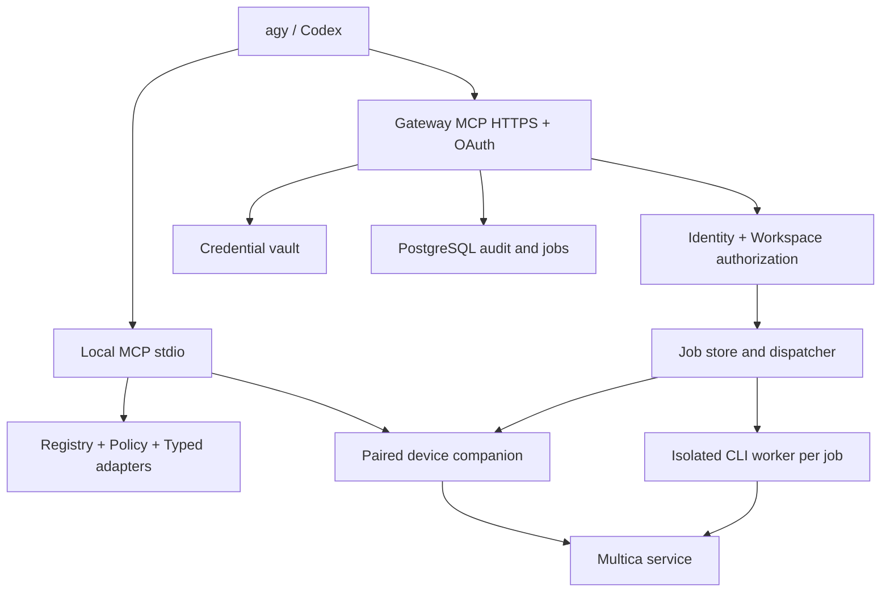

# Technical Design — Multica MCP Platform

## Context
Produk harus melayani banyak identitas dan seluruh CLI, termasuk command dengan efek pada mesin lokal. Menggunakan satu proses CLI dengan token/HOME bersama tidak dapat memenuhi isolasi tersebut. Korkyzer memberi contoh adapter CLI dan create agent; strider2038 memberi contoh pemisahan use case serta read-only guard. Keduanya menjadi referensi, bukan fondasi multi-tenant yang diadopsi tanpa perubahan.

## Goals / Non-Goals
Goals: parity yang terukur, onboarding sederhana, otorisasi end-to-end, routing perangkat, operasi yang dapat diaudit. Non-goals: arbitrary shell, bypass upstream permission, mengeksekusi perintah perangkat pada host gateway bersama, menjamin exactly-once upstream tanpa dukungan upstream.

## Decisions
### D1. Core TypeScript, CLI adapter sebagai sumber perilaku
Gunakan TypeScript strict, SDK MCP resmi, schema runtime tervalidasi, dan versi dependency terkunci. Adapter CLI utama mengurangi duplikasi API. Pin binary CLI dan checksum, serta parser per versi. REST adapter boleh ditambahkan untuk efisiensi hanya setelah contract test membuktikan parity. Node LTS spesifik dipilih dan dicatat pada M0.

### D2. Dua transport, satu policy engine
Local stdio untuk pengguna tunggal pada OS account masing-masing. Streamable HTTP untuk gateway bersama. Principal stdio ditetapkan saat provisioning koneksi, bukan dari argumen model; tidak dimaksudkan untuk OS account bersama tanpa sandbox.



Gateway menjalankan operasi remote menggunakan worker terisolasi. Operasi file, login interaktif, daemon, profil lokal, dan update berjalan pada companion. Worker tidak boleh memiliki akses filesystem companion atau host control socket. Mode local dapat memakai core yang sama tanpa PostgreSQL atau gateway.

### D2a. Batas eksekusi coding agent
`agy`, `codex`, dan coding-agent lain adalah MCP client di perangkat pengguna, bukan dependency yang dijalankan gateway. Gateway/server MUST NOT spawn, install, resume, atau mengontrol binary coding-agent tersebut. Gateway hanya memproses MCP request dan menjalankan adapter Multica CLI/API yang terdaftar pada worker terisolasi. Jika sebuah workflow perlu konteks komputer pengguna, companion pada perangkat pengguna menjalankan workflow tersebut dengan grant yang dibatasi. Deploy server MUST tidak memiliki `agy`/`codex` binary, credential coding-agent, HOME/XDG profile pengguna, atau akses shell/filsystem companion.

Dengan demikian, konfigurasi `command` pada client hanya untuk mode local/bridge:

```json
{
  "mcpServers": {
    "multica": {
      "url": "https://mcp.example.com/mcp"
    }
  }
}
```

Mode `command: /path/to/multica-mcp` berarti binary MCP berada di perangkat client dan dipakai untuk stdio local; itu bukan konfigurasi gateway bersama.

### D3. Catalog statis terverifikasi, discovery yang hemat konteks
Registry menyimpan `command_id`, canonical argv prefix, positional/flag schema, CLI version range, execution scope, risk class, required policy, secret fields, parser, timeout, streaming, retry classification, serta test IDs.

Expose tool ergonomis untuk alur umum seperti `multica_agent_create`, ditambah `multica_command_search`, `multica_command_describe`, dan `multica_command_execute`. Dispatcher execute hanya menerima command ID yang terdaftar dan arguments object yang divalidasi schema registry. Ia BUKAN raw command/argv/shell tool. Direct tools dan dispatcher wajib melewati policy yang sama. Seluruh schema dapat dipaginasi; keterbatasan jumlah tool client tidak mengurangi cakupan registry.

Contoh kontrak rancangan:
```json
{
  "command_id": "agent.create",
  "connection_id": "conn_123",
  "workspace_id": "workspace-uuid",
  "arguments": {"name": "Backend", "runtime_id": "runtime-uuid", "instructions": "Implementasikan backend"},
  "idempotency_key": "client-generated-uuid"
}
```
`principal_id`/tenant tidak diterima dari input; berasal dari session tervalidasi. `device_id` wajib untuk operasi lokal remote. `connection_id` selalu diperiksa kepemilikannya. Workspace ops global seperti list/create menggunakan scope account; agent.create wajib workspace eksplisit.

Result envelope: `operation_id`, `state`, `data`, `warnings`, `next_cursor`, `cli_version`, `request_id`; error: `code`, `retryable`, `safe_message`, `field_errors`. State: queued, running, awaiting_user_action, succeeded, failed, cancelled, outcome_unknown. Error minimum: AUTH_REQUIRED, FORBIDDEN, WORKSPACE_REQUIRED, VALIDATION_ERROR, CLI_INCOMPATIBLE, DEVICE_OFFLINE, APPROVAL_REQUIRED, RATE_LIMITED, UPSTREAM_ERROR, OUTCOME_UNKNOWN. Secret dan raw stderr tidak dikembalikan.

### D4. Identitas dan credentials
Gateway mengikuti authorization MCP untuk HTTP: protected-resource discovery, OAuth authorization-code + PKCE, audience/resource validation, issuer, signature, expiry, scopes dan redirect validation. OIDC IdP menyediakan identitas pengguna; MCP access token berbeda dari PAT Multica. Tidak meneruskan MCP token sebagai upstream token.

Koneksi Multica dibuat melalui UI HTTPS tepercaya. PAT individual disimpan envelope-encrypted memakai KMS/vault; DB hanya menyimpan ciphertext/reference. Jika delegated auth upstream tersedia kemudian, adapter auth dapat diperluas. Tidak menganggap fitur itu sudah tersedia. Token tidak pernah menjadi field tool normal.

Worker menerima secret lewat kanal privat/temp profile 0600 pada tmpfs, jika CLI versi baseline mendukung metode tersebut. HOME/XDG/profile unik; environment allowlist; token tidak di argv. Provisioning method harus diuji pada M0. Credential dihapus setelah job. Worker hanya menerima koneksi milik principal dan server origin yang sudah diverifikasi.

Effective permission = upstream authorization ∩ organization policy ∩ connection scope ∩ workspace allowance ∩ device grant ∩ consent. Recheck saat eksekusi, bukan hanya enqueue. Upstream tetap otoritatif; short-lived cache bukan pengganti keputusan upstream. Cabut sesi/grant/koneksi, batalkan queued jobs, hentikan yang dapat dihentikan, hapus cache. Side effect yang sudah terjadi tidak dapat dibatalkan lewat revocation.

### D5. Workspace dan data isolation
Setiap subprocess memakai flag workspace eksplisit; tidak menggunakan `workspace switch` untuk routing rutin. Operasi switch yang memang diminta adalah perubahan profil lokal yang disengaja, dengan lock profil. Koneksi default tidak berubah karena operasi workspace lain.

Cache key mencakup principal, tenant, connection, server origin, workspace, command, parameter hash dan policy version. Cache berisi objek upstream tidak dibagi antar principal. Redis opsional; PostgreSQL row-level security defense-in-depth memakai identity context per transaksi dan role non-bypass.

Data tables: principals; memberships; connections (owner, origin, credential_ref, status); device_grants (owner, key, scopes, expiry); policies; operations (owner, workspace, command, args_hash, state, idempotency_key); approvals (scope/hash/expiry/consumed); audit_events; artifacts (owner, operation, storage key, expiry). Composite uniqueness idempotency mencakup principal, connection, workspace dan key. Semua akses operation/artifact diperiksa kepemilikan.

### D5a. Administration control plane
Control plane administrasi terpisah dari MCP data plane. Endpoint/tool administrasi tidak diekspos sebagai tool umum kepada model. Admin berinteraksi melalui admin CLI atau UI tepercaya dengan session dan scope khusus. Semua mutasi memakai optimistic concurrency/version, validasi schema, preview diff dan audit event.

RBAC minimum: `platform_admin`, `organization_admin`, `user`, dan `auditor`. Role assignment selalu tenant-scoped kecuali platform admin. Authorization memeriksa action dan resource; mengetahui ID tenant/workspace/koneksi bukan kewenangan. Service account menggunakan scope sempit dan masa berlaku terbatas. Tidak ada superuser token yang dipakai worker untuk operasi pengguna.

Policy model disusun berurutan: platform baseline -> organization policy -> user/connection policy -> workspace policy -> device grant -> per-operation approval. Hasilnya deny-overrides; layer bawah tidak dapat memperluas layer atas. Policy bundle memiliki version dan effective time. Job menyimpan policy version saat enqueue dan mengevaluasi ulang versi terbaru tepat sebelum side effect.

Workspace modes:

- `deny_all`: tidak ada workspace yang dapat digunakan.
- `single`: tepat satu workspace yang diizinkan.
- `allowlist`: beberapa workspace ID eksplisit.
- `all_authorized`: semua workspace yang dapat diakses credential upstream, dipilih secara eksplisit dan tetap tunduk command policy.

Discovery harus memfilter hasil sesuai policy, tetapi authorization tidak bergantung pada filtering UI. Setiap operasi melakukan pemeriksaan resource secara independen. Workspace create adalah account-scoped command; workspace hasil create tidak otomatis diberikan kecuali policy menyatakan auto-enroll dan actor berhak.

Admin lifecycle mencakup organization create/suspend, membership dan role assignment, connection approve/revoke, device approve/revoke, workspace policy, command policy, risk/approval rule, quotas, retention, audit search/export, session revoke dan compatibility policy. Suspend organisasi menghentikan request baru, membatalkan queued jobs yang belum melakukan side effect, dan menandai running jobs untuk stop/reconciliation.

Secret boundary: admin hanya melihat status, fingerprint, owner, scopes dan rotation metadata suatu credential. Vault API tidak menyediakan plaintext export. Debug/support bundle harus redacted. Auditor hanya mendapat metadata yang policy izinkan. Akses break-glass tidak termasuk MVP dan tidak boleh diimplementasikan terselubung sebagai impersonation.

Bootstrap platform admin dilakukan sekali melalui mekanisme deployment yang diaudit, lalu dinonaktifkan atau dirotasi. Perubahan IdP, issuer, vault, egress origin, global deny dan signing key dianggap platform-critical dan memerlukan step-up authentication serta approval sesuai kebijakan organisasi.

### D6. Executor dan companion
Gunakan absolute executable path terverifikasi, spawn argv array tanpa shell, daftar environment eksplisit, process-group cancellation, batas CPU/memori/output/waktu. Worker satu job per sandbox; filesystem read-only kecuali tmpfs. Larang Docker socket, host mounts, cloud metadata, dan privilege escalation. Endpoint self-hosted memerlukan enrollment origin; cegah SSRF DNS-rebinding/redirect. Endpoint private hanya melalui connector/perangkat yang diizinkan, bukan egress gateway umum.

Companion memakai koneksi outbound TLS dan key perangkat; pairing lewat browser/terminal tepercaya. Gateway mengirim grant singkat bertanda tangan yang terikat principal, connection, device, workspace, command, parameter hash, nonce dan expiry. Companion menolak replay, grant salah perangkat, atau command di luar kebijakan lokal. Tidak ada command shell bebas.

Path ditentukan pengguna melalui root yang diizinkan; canonicalize dan tolak traversal/symlink escape. Upload/download melalui artifact handle berumur pendek, ownership check, size limit dan signed URL pendek; jangan menerima path server dari client remote. Operasi akses filesystem sendiri tetap memerlukan sandbox/izin OS: pairing bukan izin universal.

`daemon start` diluncurkan melalui mekanisme lifecycle CLI yang diuji; MCP job selesai ketika start terverifikasi, bukan menunggu daemon mati. Logs follow dibatasi sesi dan dapat dibatalkan. Restart/stop terkait profil/perangkat yang benar. CLI update dilakukan companion updater terpisah, lock binary, verifikasi checksum/provenance, rollback dan cek kompatibilitas. Jangan mengganti binary worker ketika job berjalan.

### D7. Kebijakan dampak dan approval
Read-only, routine-write, destructive, credential, code-execution, device-admin adalah klasifikasi dasar. Kategori terakhir mencakup custom_args/runtime_config, instalasi skill, MCP server command/env, permission mode dan checkout yang dapat membawa kode. Field tetap terakomodasi dalam registry, tetapi disaring dengan policy dan perlu consent sesuai risiko; tidak dihilangkan demi klaim parity semu.

Approval diterbitkan UI tepercaya, sekali pakai, expiry 5 menit, terikat hash canonical input dan policy version. Tool arg `approved=true` tidak memiliki kewenangan. Perubahan parameter atau policy memerlukan evaluasi ulang. Model tidak dapat menerbitkan approval. Write rutin yang diotorisasi tidak perlu dialog tambahan. Read-only dipaksakan pada executor termasuk dispatcher.

### D8. Reliability dan side effects
Persist operation sebelum dispatch. Idempotency key sama dan hash sama mengembalikan operation yang sama; hash berbeda menghasilkan conflict. Read retry memakai exponential backoff + jitter dan deadline. Write setelah timeout tidak otomatis diulang. Jika upstream tidak menyediakan idempotency, simpan outcome_unknown dan lakukan lookup/reconciliation; nama agent bukan idempotency key yang cukup. Lock reservation mencegah duplicate concurrent request dalam platform, bukan menjamin exactly-once upstream.

Cancel menghentikan subprocess bila aman, tetapi tidak membatalkan efek upstream. Return status hasil rekonsiliasi, jangan menjanjikan rollback. Batch melaporkan per-item outcome; tidak menyatakan atomic tanpa transaksi upstream. Streaming memakai cursor/sequence dan ukuran halaman terbatas. Response output CLI non-JSON memakai parser khusus, bukan asumsi semua command mendukung --output json.

### D9. Logging, limits, dan observability
Log default hanya request ID, principal pseudonymous, workspace, command, state, duration dan error code. Tidak menyimpan prompt, isi file, argv rahasia, runtime_config, env, token atau raw stderr. Sanitasi juga berlaku pada tracing, crash dump dan debug. Audit immutable secara aplikasi, akses terpisah dan export per tenant.

Batas awal: input tool 1 MiB, output inline 256 KiB, artifact 50 MiB, read timeout 30 detik, write 120 detik; long job melalui status/poll. Limit dapat disesuaikan per command/policy, tidak memotong diam-diam. Quota 60 request/menit/pengguna dan 2 job aktif awal; registry discovery ikut dibatasi. Default retensi mengikuti PRD.

## Full CLI semantics
Global profile/server-url dipetakan ke connection yang diprovision, bukan menerima origin atau profile path sewenang-wenang. Debug hanya diagnostics redacted. Output format raw yang diminta diberikan sebagai artifact aman; JSON adalah default MCP. File/stdin melalui handle; token melalui secret reference. Interactive command menghasilkan awaiting_user_action dan resume melalui UI companion. Help dan shell completion dipetakan ke discovery/artifact, bukan raw shell execution.

## Compatibility and release
Baseline: pilih tag CLI stabil, commit, checksum dan supported OS pada M0; belum dipatok dalam dokumen ini. Crawl seluruh help tree dalam sandbox dan cocokkan source command registration. Audit global/inherited flags, aliases, hidden/deprecated dan platform-specific commands. Command internal tidak publik didaftarkan dengan alasan klasifikasinya; tidak boleh hilang tanpa review. Jika hidden command dibutuhkan workflow resmi, masuk baseline parity.

Client agy dan Codex adalah target penerimaan, bukan klaim dukungan native semua fitur. Uji stdio dahulu; gateway native HTTP/OAuth diuji per versi client, dengan bridge stdio sebagai fallback. Extension MCP opsional tidak wajib untuk operasi inti: job polling dan trusted browser UI tetap tersedia.

### D10. Testability tanpa AI client
MCP server MUST dapat diuji tanpa agy atau Codex. Sediakan empat lapisan:

1. **Protocol contract tests** menggunakan MCP SDK client/harness atau MCP Inspector untuk `initialize`, capability discovery, tool schema, validasi input, error envelope, pagination, cancellation, progress, dan transport stdio/HTTP. Harness ini mengirim JSON-RPC/MCP request deterministik dan menjadi sumber diagnosis protocol.
2. **Component tests** menggunakan fake Multica CLI/API, fake vault, policy engine, worker dan companion adapter. Fake harus merekam argv/environment yang sudah disanitasi, memastikan tidak ada shell invocation, workspace leakage, retry write, atau secret logging.
3. **Staging integration tests** menjalankan binary CLI versi terpatok terhadap tenant/workspace staging dengan principal read-only dan write terbatas. Tes ini memverifikasi create-agent, outcome reconciliation, authorization, runtime/workspace scope, dan seluruh command manifest.
4. **Client interoperability smoke tests** menjalankan konfigurasi nyata agy dan Codex pada versi yang dicatat. Lapisan ini hanya menguji discovery, invoke, streaming/approval dan rendering; kegagalan di sini tidak boleh menutupi hasil protocol/component/staging.

Setiap test case memiliki `layer`, `command_id`, `client_version` (bila ada), `cli_version`, `workspace_fixture`, `principal_fixture`, `expected_side_effect`, dan `redaction_assertions`. CI wajib menjalankan lapisan 1–2 tanpa credentials. Lapisan 3 memakai secret staging terisolasi. Lapisan 4 boleh nightly atau release gate sesuai availability client. Log diagnosis menyimpan request ID dan klasifikasi error, bukan prompt, token, atau raw payload sensitif.

## Risks / Trade-offs
CLI subprocess menambah latency dan risiko drift; mitigasi pinning, contract tests dan registry versioning. Worker isolation serta companion menambah kompleksitas dibanding repo komunitas, tetapi dibutuhkan untuk shared deployment. Credential upstream mungkin luas; batasi melalui policy dan jangan gunakan token admin bersama. Konten upstream dapat mengandung prompt injection; pemisahan policy dan trusted approval membatasi dampaknya.

## Migration Plan
Mulai greenfield modular; port hanya adapter yang teruji dan pertahankan lisensi/attribution bila menyalin kode. Jangan membawa logger raw input atau shared workspace mutable. Pilot subset -> laporan gap -> complete coverage -> staged rollout. Rollback gateway/schema melalui migration backward-compatible; worker binary pinned per job, companion handshake menolak versi tidak cocok.

## Open Questions
Pemilihan IdP/hosting, versi CLI dan client, kebijakan perusahaan, batas skala nyata, serta credential bootstrap perlu divalidasi pada M0. Pertanyaan ini tidak menunda dokumen; menjadi tugas implementasi dengan gate eksplisit sebelum rollout.
